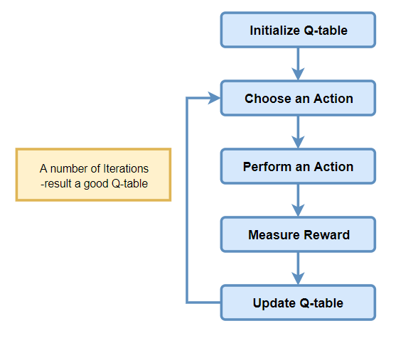
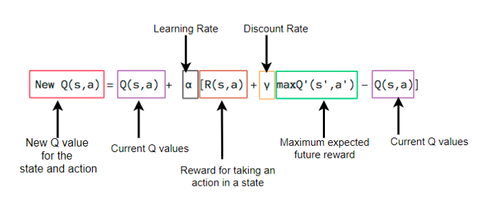

# CartPole game using Q-Learning Reinforcement algorithm.

#### Hyper parameters
* Learning rate - 0.1
* Discount factor - 0.4
* Reward
    * Success : +1
    * Failure : -250

#### Training & Testing
* Trained for 500000 episodes
* Tested for 5000 episodes

#### Steps

#### Q-Learning algorithm
